## Задача №1

Вывести служебную информацию о пакете matplotlib (Python). Разобрать основные элементы содержимого файла со служебной информацией из пакета. Как получить пакет без менеджера пакетов, прямо из репозитория?

## Решение
```bash
apt show python3-matplotlib
```

## Тестирование


## Задача №2

Вывести служебную информацию о пакете express (JavaScript). Разобрать основные элементы содержимого файла со служебной информацией из пакета. Как получить пакет без менеджера пакетов, прямо из репозитория?

## Решение

```bash
apt show node-express
```

## Тестирование


## Задача №3

Сформировать graphviz-код и получить изображения зависимостей matplotlib и express.

## Решение для matplotlib

```dot
DIGRAPH "MATPLOTLIB-PYTHON" {
	MATPLOTLIB -> "LIBJS-JQUERY"
	MATPLOTLIB -> "LIBJS-JQUERY-UI"
	MATPLOTLIB -> "PYTHON-MATPLOTLIB-DATA"
	MATPLOTLIB -> "PYTHON3-DATEUTIL"
	MATPLOTLIB -> "PYTHON3-PIL.IMAGETK"
	MATPLOTLIB -> "PYTHON3-SIX"
	MATPLOTLIB -> "PYTHON3-NUMPY"
	MATPLOTLIB -> "PYTHON3-NUMPY-ABI9"
	MATPLOTLIB -> PYTHON3
	MATPLOTLIB -> PYTHON3
	MATPLOTLIB -> "PYTHON3-CYCLER"
	MATPLOTLIB -> "PYTHON3-FONTTOOLS"
	MATPLOTLIB -> "PYTHON3-KIWISOLVER"
	MATPLOTLIB -> "PYTHON3-PIL"
	MATPLOTLIB -> "PYTHON3-ANY"
	MATPLOTLIB -> LIBC6
	MATPLOTLIB -> LIBFREETYPE6
	MATPLOTLIB -> "LIBGCC-S1"
	MATPLOTLIB -> "LIBQHULL-R8.0"
	MATPLOTLIB -> "LIBSTDC++6"
}
```



## Результаты для matplotlib 


## Решение для express

```dot
DIGRAPH "NODE-EXPRESS" {
	EXPRESS -> "NODE-ACCEPTS"
	EXPRESS -> "NODE-ARRAY-FLATTEN"
	EXPRESS -> "NODE-BODY-PARSER"
	EXPRESS -> "NODE-CONTENT-DISPOSITION"
	EXPRESS -> "NODE-CONTENT-TYPE"
	EXPRESS -> "NODE-COOKIE"
	EXPRESS -> "NODE-COOKIE-SIGNATURE"
	EXPRESS -> "NODE-DEBUG"
	EXPRESS -> "NODE-DEPD"
	EXPRESS -> "NODE-ENCODEURL"
	EXPRESS -> "NODE-ESCAPE-HTML"
	EXPRESS -> "NODE-ETAG"
	EXPRESS -> "NODE-FINALHANDLER"
	EXPRESS -> "NODE-FRESH"
	EXPRESS -> "NODE-MERGE-DESCRIPTORS"
	EXPRESS -> "NODE-METHODS"
	EXPRESS -> "NODE-ON-FINISHED"
	EXPRESS -> "NODE-PARSEURL"
	EXPRESS -> "NODE-PATH-TO-REGEXP"
	EXPRESS -> "NODE-PROXY-ADDR"
	EXPRESS -> "NODE-QS"
	EXPRESS -> "NODE-RANGE-PARSER"
	EXPRESS -> "NODE-SAFE-BUFFER"
	EXPRESS -> "NODE-SEND"
	EXPRESS -> "NODE-SERVE-STATIC"
	EXPRESS -> "NODE-SETPROTOTYPEOF"
	EXPRESS -> "NODE-STATUSES"
	EXPRESS -> "NODE-TYPE-IS"
	EXPRESS -> "NODE-UTILS-MERGE"
	EXPRESS -> "NODE-VARY"
	EXPRESS -> NODEJS:ANY
}
```



## Результаты для express


## Задача №4

Решить на MiniZinc задачу о счастливых билетах. Добавить ограничение на то, что все цифры билета должны быть различными (подсказка: используйте all_different). Найти минимальное решение для суммы 3 цифр.

## Решение

```MiniZinc
include "alldifferent.mzn";

var 0..9: n1;
var 0..9: n2;
var 0..9: n3;
var 0..9: n4;
var 0..9: n5;
var 0..9: n6;

constraint n1 + n2 + n3 == n4 + n5 + n6;
constraint all_different([n1, n2, n3, n4, n5, n6]);
solve minimize n1 + n2 + n3;
```

## Тестирование


## Задача №5

Решить на MiniZinc задачу о зависимостях пакетов для рисунка, приведенного ниже.


## Решение

```MiniZinc
% Формат записи версии
type Version = tuple(int, int, int);

% Формат записи информации о пакете: имя, версия
type Package = tuple(string, Version);

% Корневой пакет
Package: rootPackage = ("root", (1,0,0));
 
% Существование пакета (0/1)
array[1..14] of var 0..1: existances; 

% Определение пакетов
array[1..14] of Package: packages = [
  ("root", (1,0,0)),
  ("menu", (1,0,0)),
  ("menu", (1,1,0)),
  ("menu", (1,2,0)),
  ("menu", (1,3,0)),
  ("menu", (1,4,0)),
  ("menu", (1,5,0)),
  ("dropdown", (1,8,0)),
  ("dropdown", (2,0,0)),
  ("dropdown", (2,1,0)),
  ("dropdown", (2,2,0)),
  ("dropdown", (2,3,0)),
  ("icons", (1,0,0)),
  ("icons", (2,0,0))
];

% Условие для скачивания
constraint
  (existances[1] == 1 /\
  (packages[2].2 >= rootPackage.2 /\ existances[2] == 1 \/
  packages[3].2 >= rootPackage.2 /\ existances[3] == 1 \/
  packages[4].2 >= rootPackage.2 /\ existances[4] == 1 \/
  packages[5].2 >= rootPackage.2 /\ existances[5] == 1 \/
  packages[6].2 >= rootPackage.2 /\ existances[6] == 1 \/
  packages[7].2 >= rootPackage.2 /\ existances[7] == 1) /\
  (exists(i in 2..7)(packages[i].2 == (1,0,0) /\ existances[i] == 1) /\ existances[8] == 1 \/
  exists(i in 2..7)(packages[i].2 > (1,0,0) /\ existances[i] == 1) /\ existances[9] == 1 \/
  exists(i in 2..7)(packages[i].2 > (1,0,0) /\ existances[i] == 1) /\ existances[10] == 1 \/
  exists(i in 2..7)(packages[i].2 > (1,0,0) /\ existances[i] == 1) /\ existances[11] == 1 \/
  exists(i in 2..7)(packages[i].2 > (1,0,0) /\ existances[i] == 1) /\ existances[12] == 1) /\
  (packages[13].2 == rootPackage.2 /\ existances[13] == 1 \/
  exists(i in 8..12)(packages[i].2 > (1,8,0) /\ existances[i] == 1) /\ existances[14] == 1)) == true;
  
 % Определение минимального числа пакетов для скачивания
 solve minimize sum(existances);

% Вывод в результате в формате: пакет не скачан или скачан(0/1), сам пакет 
output [
  show(existances[i]) ++ " " ++ show(packages[i]) ++ "\n" | i in 1..14,
];
```

## Тестирование


## Задача №6

Решить на MiniZinc задачу о зависимостях пакетов для следующих данных:

```
root 1.0.0 зависит от foo ^1.0.0 и target ^2.0.0.
foo 1.1.0 зависит от left ^1.0.0 и right ^1.0.0.
foo 1.0.0 не имеет зависимостей.
left 1.0.0 зависит от shared >=1.0.0.
right 1.0.0 зависит от shared <2.0.0.
shared 2.0.0 не имеет зависимостей.
shared 1.0.0 зависит от target ^1.0.0.
target 2.0.0 и 1.0.0 не имеют зависимостей.
```

## Решение

```MinZinc
% Формат записи версии
type Version = tuple(int, int, int);

% Формат записи информации о пакете: имя, версия
type Package = tuple(string, Version);

% Пакет, который хотим загрузить
Package: targetPackage = ("root", (1,0,0)); 

% Определение пакетов
array[1..9] of Package: packages = [
  ("root", (1,0,0)),
  ("foo", (1,1,0)),
  ("foo", (1,0,0)),
  ("left", (1,0,0)),
  ("right", (1,0,0)),
  ("shared", (2,0,0)),
  ("shared", (1,0,0)),
  ("target", (2,0,0)),
  ("target", (1,0,0))
];

% Существование пакета (0/1)
array[1..9] of var 0..1: existances;

% Условие для скачивания
constraint
  ((existances[1] == 1 -> (exists(i in 2..3)(existances[i] == 1 /\ (1,0,0) <= packages[i].2 /\ packages[i].2 < (2,0,0)))) /\
  (existances[1] == 1 -> (exists(i in 8..9)(existances[i] == 1 /\ (2,0,0) <= packages[i].2 /\ packages[i].2 < (3,0,0)))) /\
  (existances[2] == 1 -> ((existances[4] == 1 /\ (1,0,0) <= packages[4].2 /\ packages[4].2 < (2,0,0)))) /\
  (existances[2] == 1 -> ((existances[5] == 1 /\ (1,0,0) <= packages[5].2 /\ packages[5].2 < (2,0,0)))) /\
  (existances[3] == 1 -> true) /\
  (existances[4] == 1 -> (exists(i in 6..7)(existances[i] == 1 /\ packages[i].2 >= (1,0,0)))) /\
  (existances[5] == 1 -> (exists(i in 6..7)(existances[i] == 1 /\ packages[i].2 < (2,0,0)))) /\
  (existances[6] == 1 -> true) /\
  (existances[7] == 1 -> (exists(i in 8..9)(existances[i] == 1 /\ (1,0,0) <= packages[i].2 /\ packages[i].2 < (2,0,0)))) /\ 
  (existances[8] == 1 -> true) /\
  (existances[9] == 1 -> true) /\
  (exists(i in 1..9)(existances[i] == 1 /\ packages[i] == targetPackage))) == true;
  
 % Определение минимального числа пакетов для скачивания
 solve minimize sum(existances);

% Вывод в результате в формате: пакет не скачан или скачан(0/1), сам пакет 
output [
  show(existances[i]) ++ " " ++ show(packages[i]) ++ "\n" | i in 1..9,
];
```

## Тестирование


## Задача №7

Представить на MiniZinc задачу о зависимостях пакетов в общей форме, чтобы конкретный экземпляр задачи описывался только своим набором данных.

## Решение

Для реализации решения задачи о зависимостях пользователю необходимо указать данные о пакетах в файле с расширением dzn. Сначала указывается пакет, который необходимо скачать. Данные о нём вводится в формате: имя пакета, версия пакета. Далее необходимо перечислить все пакеты, которые необходимо загрузить в том же формате, что целевой пакет. Затем перечисляются зависимости между пакетами в формате имя загружаемого пакета, версия загружаемого пакета, имя пакета, от которого зависит загружаемый пакет, версия пакета, условие для версии пакета, от которого зависит загружаемый в виде литерала.

### Замечания:

* возможные литералы: "^", "~", ">", "<", ">=" ,"<=", "=";
* если указан литерал, отличный то указанных, то выполняется условие: "="
* если пакетов, от которых зависит данный не существует, то для имени указывается "-", для версии - (0,0,0), для литерала "-"

### Код программы

```MiniZinc
% Формат записи версии
type Version = tuple(int, int, int);

% Формат записи информации о пакете: имя, версия
type Package = record(string: name, Version: version);

% Формат записи зависимости
type Dependence = record(Package: installedPackage, Package: requiredPackage, string: literal);  

% Проверка на существоание элемента с заданным индексом
predicate checkExistance(int: index) = exists(i in 1..n)(existances[i] == 1 /\ packages[i] == dependences[index].installedPackage);

% Варианты сравнения 
predicate compatibleVersionRange(Version: version1, Version: version2) = version2 <= version1 /\ version1 < (version2.1 + 1, 0, 0);

predicate closeVersions(Version: version1, Version: version2) = version2 <= version1 /\
version1 < (version2.1 + (version2.2 + 1) div 10, (version2.2 + 1) mod 10, 0);

predicate greater(Version: version1, Version: version2) = version1 > version2;

predicate less(Version: version1, Version: version2) = version1 < version2;

predicate greaterOrEqual(Version: version1, Version: version2) = version1 >= version2;

predicate lessOrEqual(Version: version1, Version: version2) = version1 <= version2;

predicate equal(Version: version1, Version: version2) = version1 == version2;

% Получение результата сравнения
predicate getResult(Version: version1, Version: version2, string: literal) = 
  if literal == "^" then
    compatibleVersionRange(version1, version2)
  elseif literal == "~" then
    closeVersions(version1, version2)
  elseif literal == ">" then
    greater(version1, version2)
  elseif literal == "<" then
    less(version1, version2)
  elseif literal == ">=" then
    greaterOrEqual(version1, version2)
  elseif literal == "<=" then
    lessOrEqual(version1, version2)
  else
    equal(version1, version2)
  endif;

% Получение следования из существования элемента
predicate getImplication(Package: package, string: literal) =
  if package.name == "-" then
    true
  else
    exists(i in 1..n)(existances[i] == 1 /\ packages[i].name == package.name /\ 
    getResult(package.version, packages[i].version, literal))
  endif;
  
% Пакет, который хотим загрузить
Package: targetPackage; 

array[_] of Package: packages; % Массив пакетов
array[_] of Dependence: dependences; % Массив зависимостей

int: n = length(packages); % Длина массива пакетов
int: m = length(dependences); % Длина массива зависимостей

% Существование пакета (0/1)
array[1..n] of var 0..1: existances;

% Условие для скачивания
constraint (exists(j in 1..n)(existances[j] == 1 /\ packages[j] == targetPackage)) /\ forall(i in 1..m) ( 
  checkExistance(i) -> getImplication(dependences[i].requiredPackage, dependences[i].literal) == true
);
  
 % Определение минимального числа пакетов для скачивания
 solve minimize sum(existances);
 
% Вывод в результате в формате: пакет не скачан или скачан(0/1), сам пакет 
output [
  show(existances[i]) ++ " " ++ show(packages[i]) ++ "\n" | i in 1..n,
];
```

## Пример входных данных


## Тестирование задачи для данных из задачи №6


