## Задача №1

Вывести служебную информацию о пакете matplotlib (Python). Разобрать основные элементы содержимого файла со служебной информацией из пакета. Как получить пакет без менеджера пакетов, прямо из репозитория?

## Решение
```bash
apt show python3-matplotlib
```

## Тестирование


## Задача №2

Вывести служебную информацию о пакете express (JavaScript). Разобрать основные элементы содержимого файла со служебной информацией из пакета. Как получить пакет без менеджера пакетов, прямо из репозитория?

## Решение

```bash
apt show node-express
```

## Тестирование


## Задача №3

Сформировать graphviz-код и получить изображения зависимостей matplotlib и express.

## Решение для matplotlib

```dot
DIGRAPH "MATPLOTLIB-PYTHON" {
	MATPLOTLIB -> "LIBJS-JQUERY"
	MATPLOTLIB -> "LIBJS-JQUERY-UI"
	MATPLOTLIB -> "PYTHON-MATPLOTLIB-DATA"
	MATPLOTLIB -> "PYTHON3-DATEUTIL"
	MATPLOTLIB -> "PYTHON3-PIL.IMAGETK"
	MATPLOTLIB -> "PYTHON3-SIX"
	MATPLOTLIB -> "PYTHON3-NUMPY"
	MATPLOTLIB -> "PYTHON3-NUMPY-ABI9"
	MATPLOTLIB -> PYTHON3
	MATPLOTLIB -> PYTHON3
	MATPLOTLIB -> "PYTHON3-CYCLER"
	MATPLOTLIB -> "PYTHON3-FONTTOOLS"
	MATPLOTLIB -> "PYTHON3-KIWISOLVER"
	MATPLOTLIB -> "PYTHON3-PIL"
	MATPLOTLIB -> "PYTHON3-ANY"
	MATPLOTLIB -> LIBC6
	MATPLOTLIB -> LIBFREETYPE6
	MATPLOTLIB -> "LIBGCC-S1"
	MATPLOTLIB -> "LIBQHULL-R8.0"
	MATPLOTLIB -> "LIBSTDC++6"
}
```



## Результаты для matplotlib 


## Решение для express

```dot
DIGRAPH "NODE-EXPRESS" {
	EXPRESS -> "NODE-ACCEPTS"
	EXPRESS -> "NODE-ARRAY-FLATTEN"
	EXPRESS -> "NODE-BODY-PARSER"
	EXPRESS -> "NODE-CONTENT-DISPOSITION"
	EXPRESS -> "NODE-CONTENT-TYPE"
	EXPRESS -> "NODE-COOKIE"
	EXPRESS -> "NODE-COOKIE-SIGNATURE"
	EXPRESS -> "NODE-DEBUG"
	EXPRESS -> "NODE-DEPD"
	EXPRESS -> "NODE-ENCODEURL"
	EXPRESS -> "NODE-ESCAPE-HTML"
	EXPRESS -> "NODE-ETAG"
	EXPRESS -> "NODE-FINALHANDLER"
	EXPRESS -> "NODE-FRESH"
	EXPRESS -> "NODE-MERGE-DESCRIPTORS"
	EXPRESS -> "NODE-METHODS"
	EXPRESS -> "NODE-ON-FINISHED"
	EXPRESS -> "NODE-PARSEURL"
	EXPRESS -> "NODE-PATH-TO-REGEXP"
	EXPRESS -> "NODE-PROXY-ADDR"
	EXPRESS -> "NODE-QS"
	EXPRESS -> "NODE-RANGE-PARSER"
	EXPRESS -> "NODE-SAFE-BUFFER"
	EXPRESS -> "NODE-SEND"
	EXPRESS -> "NODE-SERVE-STATIC"
	EXPRESS -> "NODE-SETPROTOTYPEOF"
	EXPRESS -> "NODE-STATUSES"
	EXPRESS -> "NODE-TYPE-IS"
	EXPRESS -> "NODE-UTILS-MERGE"
	EXPRESS -> "NODE-VARY"
	EXPRESS -> NODEJS:ANY
}
```



## Результаты для express


